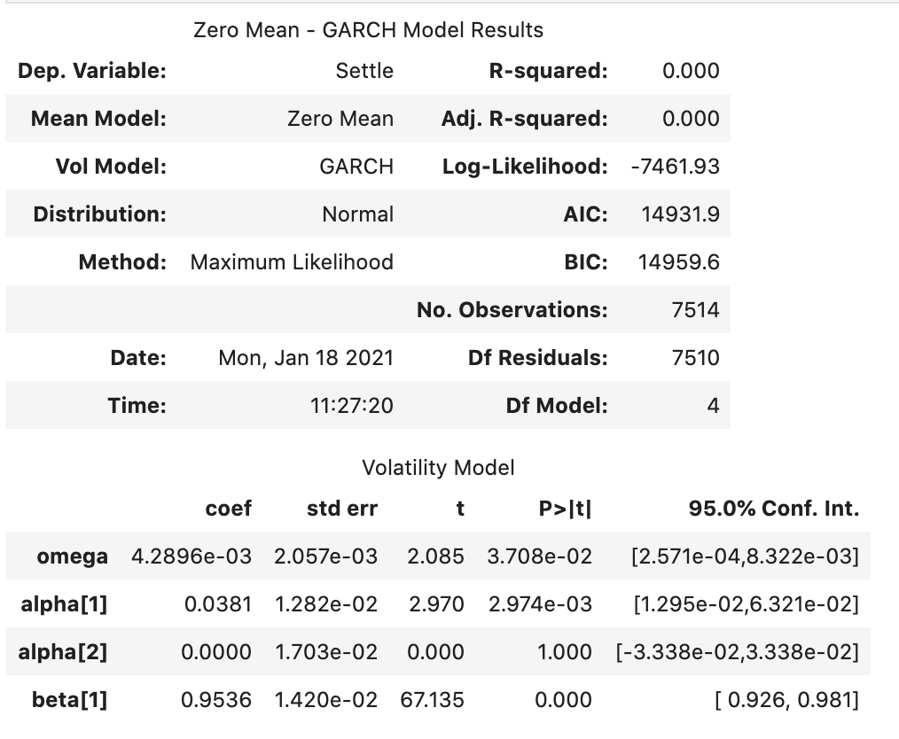

# Unit 10 - Time Series Analysis Observations

### Illustrating Trend over Actual YEN Settle Prices

### Plotting YEN Noise after Decomposition

### ARMA Results
- Indicate not a good model for data as P Values are high

### ARIMA Results
- Also Indicate not a good model for data as P Values are high and higher AIC/BIC values than ARMA model

### GARCH Results
- GARCH indicates that volatility is increasing and therefore contains more risk in buying YEN but with also the changes of higher return.

# Regression Analysis and Performances

The ratio between Standard Deviation on Returns and RMSE was almost one indicating our model was not a good fit using Linear Regression Analysis.

